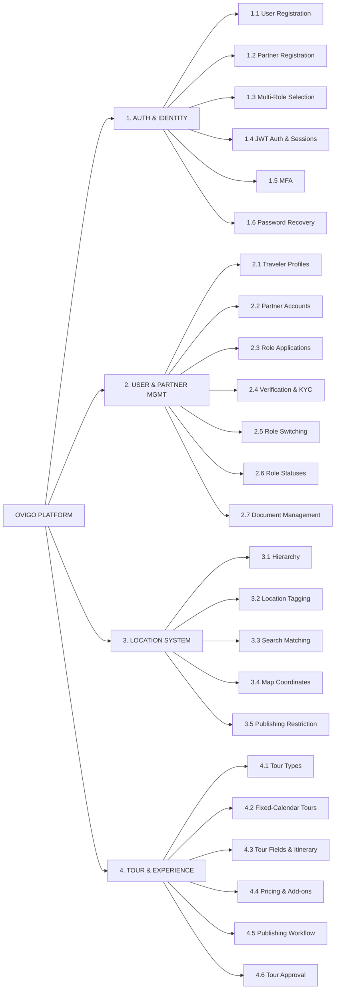
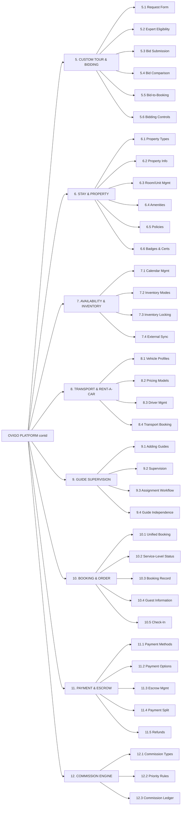
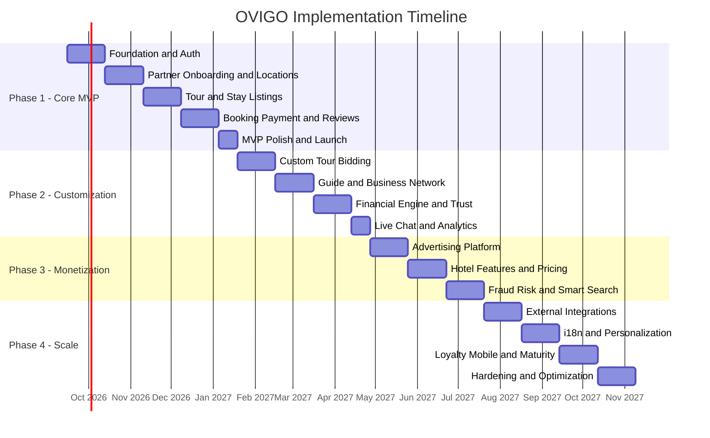

# OVIGO — Technical Architecture & Implementation Document

> **Document Version:** 1.0  
> **Product:** Ovigo — Local Expert, Host & Stay Booking Platform  
> **Tech Stack:** FastAPI (Backend) · Next.js (Frontend) · NeonDB PostgreSQL (Database)  
> **Hosting:** FastAPI Cloud (API) · Vercel (Web App)  
> **Date:** August 2026  

---

## Table of Contents

- [1. System Overview](#1-system-overview)
- [2. Level-0 System Diagram](#2-level-0-system-diagram)
- [3. Technology Stack & Infrastructure](#3-technology-stack--infrastructure)
- [4. System Architecture](#4-system-architecture)
- [5. Core Data Entities & Database Schema](#5-core-data-entities--database-schema)
- [6. API Module Breakdown](#6-api-module-breakdown)
- [7. Frontend Application Architecture](#7-frontend-application-architecture)
- [8. Phase-by-Phase Implementation Plan](#8-phase-by-phase-implementation-plan)
- [9. Non-Functional Requirements & Compliance](#9-non-functional-requirements--compliance)
- [10. KPIs & Analytics Strategy](#10-kpis--analytics-strategy)
- [11. MVP Acceptance Criteria](#11-mvp-acceptance-criteria)
- [12. Risk Register & Mitigation](#12-risk-register--mitigation)
- [13. Consolidated Timeline Summary](#13-consolidated-timeline-summary)

---

## 1. System Overview

Ovigo is a **location-based tourism marketplace** that connects travelers with verified Local Experts, Hosts, Guides, Hotels/Resorts, and Rent-a-Car operators. The platform enables:

| Capability | Description |
|---|---|
| **Destination Discovery** | Location-tagged search across experts, tours, stays, and services |
| **Fixed & Custom Tours** | Calendar-based departures + custom request bidding system |
| **Stay Booking** | Hotels, resorts, homestays, guesthouses with full inventory management |
| **Service Bundling** | Transport, food, activities, guides attached to bookings |
| **Trust & Verification** | Multi-tier partner verification, security badges, verified reviews |
| **Revenue Engine** | Commissions, escrow, payouts, advertising, featured listings |
| **Live Communication** | Pre/post-booking chat with moderation |

### 1.1 Primary Platforms

| Platform | Technology | Hosting |
|---|---|---|
| Customer Web | Next.js (SSR/SSG) | Vercel |
| Customer Mobile App | React Native / Flutter (future) | App Stores |
| Partner App / Dashboard | Next.js (SPA mode) | Vercel |
| Super Admin Dashboard | Next.js (SPA mode) | Vercel |
| Backend API | FastAPI (Python) | FastAPI Cloud |
| Database | PostgreSQL | NeonDB |

### 1.2 Core User Flow

```
Destination Discovery → Local Expert → Tour/Stay Selection → Booking → Payment → Service Completion → Verified Review
```

### 1.3 Revenue Streams

- Booking commissions (tours, stays, transport)
- Tour and experience sales commissions
- Stay booking commissions
- Transport and service commissions
- Referral / network commissions
- Featured listing fees
- Sponsored search placement
- Advertising campaigns
- Optional subscription / premium partner plans

### 1.4 Product Scope — Included

- Local Expert registration and verification
- Host, Guide, Hotel and Rent-a-Car registration
- Multi-role partner accounts
- Local Expert, Host, Guide public profiles
- Fixed-calendar tour listings & local experiences
- Customized tour request and bidding
- Stay listing and booking with room/inventory management
- Availability calendars
- Transportation profiles
- Food menu and meal package management
- Activity and add-on management
- Location tagging (Country → Attraction)
- Live chat
- Verified reviews & security badges
- Partner-created businesses and services
- Referral and network commission
- Advertising and boosted listings
- Booking, payments, escrow and payouts
- Super Admin management
- Partner App dashboards
- Analytics and financial reporting

### 1.5 Product Scope — Excluded

- Outbound international packages
- Visa processing & airline ticketing
- Travel agency CRM
- International agency collaboration
- Contributor content earning & travel-blog publishing
- Full local-product e-commerce fulfillment

---

## 2. Level-0 System Diagram

### 2.1 System Architecture Diagram

```mermaid
graph TB
    subgraph "CLIENT LAYER"
        CW["Customer Web - Next.js on Vercel"]
        PA["Partner App - Next.js on Vercel"]
        SA["Super Admin Dashboard - Next.js on Vercel"]
        MA["Mobile App - Future Phase"]
    end

    subgraph "API GATEWAY"
        AG["API Gateway / Load Balancer"]
    end

    subgraph "FASTAPI SERVICES on FastAPI Cloud"
        AUTH["Auth and Identity Service"]
        USER["User and Partner Management Service"]
        LOC["Location Tagging Service"]
        TOUR["Tour and Experience Service"]
        BID["Custom Tour and Bidding Service"]
        STAY["Stay and Property Service"]
        INV["Availability and Inventory Service"]
        TRANS["Transport and Rent-a-Car Service"]
        GUIDE["Guide Supervision Service"]
        BOOK["Booking and Order Service"]
        PAY["Payment and Escrow Service"]
        COMM["Commission Engine"]
        PAYOUT["Payout Service"]
        REV["Review and Rating Service"]
        CHAT["Live Chat Service"]
        ADS["Advertising and Promotion Service"]
        NOTIF["Notification Service"]
        SEARCH["Search and Discovery Service"]
        ANALYTICS["Analytics and Reporting Service"]
        ADMIN["Admin Control Service"]
        FRAUD["Fraud and Risk Service"]
        BADGE["Badge and Certification Service"]
        BNET["Business Network and Referral Service"]
    end

    subgraph "DATA LAYER"
        DB[("NeonDB PostgreSQL")]
        CACHE["Redis Cache"]
        BLOB["Object Storage - S3/R2"]
        QUEUE["Message Queue - Celery/Redis"]
    end

    subgraph "EXTERNAL INTEGRATIONS"
        PG["Payment Gateways - bKash, Nagad, SSLCommerz, Stripe"]
        SMS["SMS Provider"]
        EMAIL["Email Service - SendGrid/SES"]
        PUSH["Push Service - Firebase FCM"]
        MAP["Maps API - Google Maps"]
        IDVERIFY["ID Verification - 3rd party KYC"]
    end

    CW --> AG
    PA --> AG
    SA --> AG
    MA --> AG

    AG --> AUTH
    AG --> USER
    AG --> LOC
    AG --> TOUR
    AG --> BID
    AG --> STAY
    AG --> INV
    AG --> TRANS
    AG --> GUIDE
    AG --> BOOK
    AG --> PAY
    AG --> COMM
    AG --> PAYOUT
    AG --> REV
    AG --> CHAT
    AG --> ADS
    AG --> NOTIF
    AG --> SEARCH
    AG --> ANALYTICS
    AG --> ADMIN
    AG --> FRAUD
    AG --> BADGE
    AG --> BNET

    AUTH --> DB
    USER --> DB
    LOC --> DB
    TOUR --> DB
    BID --> DB
    STAY --> DB
    INV --> DB
    TRANS --> DB
    GUIDE --> DB
    BOOK --> DB
    PAY --> DB
    COMM --> DB
    PAYOUT --> DB
    REV --> DB
    CHAT --> DB
    ADS --> DB
    NOTIF --> DB
    SEARCH --> DB
    ANALYTICS --> DB
    ADMIN --> DB
    FRAUD --> DB
    BADGE --> DB
    BNET --> DB

    AUTH --> CACHE
    SEARCH --> CACHE
    INV --> CACHE
    CHAT --> CACHE

    USER --> BLOB
    STAY --> BLOB
    TOUR --> BLOB

    NOTIF --> QUEUE
    PAY --> QUEUE
    PAYOUT --> QUEUE

    PAY --> PG
    NOTIF --> SMS
    NOTIF --> EMAIL
    NOTIF --> PUSH
    LOC --> MAP
    SEARCH --> MAP
    USER --> IDVERIFY
```



### 2.2 System Sections and Subsections Breakdown

```mermaid
graph LR
    OVIGO3["OVIGO PLATFORM contd"]

    OVIGO3 --> S13["13. PAYOUT SYSTEM"]
    S13 --> S13A["13.1 Payout Eligibility"]
    S13 --> S13B["13.2 Batch Payouts"]
    S13 --> S13C["13.3 Payout Statuses"]

    OVIGO3 --> S14["14. REVIEW & RATING"]
    S14 --> S14A["14.1 Review Eligibility"]
    S14 --> S14B["14.2 Rating Breakdown"]
    S14 --> S14C["14.3 Review Moderation"]

    OVIGO3 --> S15["15. LIVE CHAT"]
    S15 --> S15A["15.1 Chat Types"]
    S15 --> S15B["15.2 Pre-Booking Chat"]
    S15 --> S15C["15.3 Post-Booking Chat"]
    S15 --> S15D["15.4 Chat Moderation"]

    OVIGO3 --> S16["16. SEARCH & DISCOVERY"]
    S16 --> S16A["16.1 Full-Text & Geo"]
    S16 --> S16B["16.2 Filters & Facets"]
    S16 --> S16C["16.3 Ranking Algorithm"]
    S16 --> S16D["16.4 Sponsored Results"]

    OVIGO3 --> S17["17. ADVERTISING"]
    S17 --> S17A["17.1 Ad Products"]
    S17 --> S17B["17.2 Targeting"]
    S17 --> S17C["17.3 Campaign Mgmt"]
    S17 --> S17D["17.4 Billing Models"]
    S17 --> S17E["17.5 Ad Reporting"]

    OVIGO3 --> S18["18. NOTIFICATION"]
    S18 --> S18A["18.1 Push"]
    S18 --> S18B["18.2 Email"]
    S18 --> S18C["18.3 SMS"]
    S18 --> S18D["18.4 In-App"]
    S18 --> S18E["18.5 Templates"]

    OVIGO3 --> S19["19. BUSINESS NETWORK"]
    S19 --> S19A["19.1 Adding Businesses"]
    S19 --> S19B["19.2 Ownership Types"]
    S19 --> S19C["19.3 Business Approval"]
    S19 --> S19D["19.4 Attribution Rules"]
    S19 --> S19E["19.5 Referral Commission"]

    OVIGO3 --> S20["20. BADGE & CERT"]
    S20 --> S20A["20.1 Badge Types"]
    S20 --> S20B["20.2 Approval Flow"]
    S20 --> S20C["20.3 Auto-Award"]
    S20 --> S20D["20.4 Sensitive Badges"]

    OVIGO3 --> S21["21. FRAUD & RISK"]
    S21 --> S21A["21.1 Risk Rules"]
    S21 --> S21B["21.2 Fraud Detection"]
    S21 --> S21C["21.3 Alerts & Actions"]

    OVIGO3 --> S22["22. ADMIN CONTROL"]
    S22 --> S22A["22.1 User Mgmt"]
    S22 --> S22B["22.2 Partner Mgmt"]
    S22 --> S22C["22.3 Verification"]
    S22 --> S22D["22.4 Location Mgmt"]
    S22 --> S22E["22.5 Tour Mod"]
    S22 --> S22F["22.6 Stay Mod"]
    S22 --> S22G["22.7 Booking Mgmt"]
    S22 --> S22H["22.8 Payment Mgmt"]
    S22 --> S22I["22.9 Commission Mgmt"]
    S22 --> S22J["22.10 Payout Mgmt"]
    S22 --> S22K["22.11 Dispute Mgmt"]
    S22 --> S22L["22.12 Review Mgmt"]
    S22 --> S22M["22.13 Ad Mgmt"]
    S22 --> S22N["22.14 Reports"]

    OVIGO3 --> S23["23. ANALYTICS"]
    S23 --> S23A["23.1 Marketplace KPIs"]
    S23 --> S23B["23.2 Expert KPIs"]
    S23 --> S23C["23.3 Stay KPIs"]
    S23 --> S23D["23.4 Trust KPIs"]
    S23 --> S23E["23.5 Ad KPIs"]

    OVIGO3 --> S24["24. RBAC"]
    S24 --> S24A["24.1 Permissions"]
    S24 --> S24B["24.2 Staff Roles"]
    S24 --> S24C["24.3 Audit Logging"]
```







---

## 3. Technology Stack & Infrastructure

### 3.1 Backend — FastAPI on FastAPI Cloud

| Component | Technology | Purpose |
|---|---|---|
| Framework | **FastAPI** (Python 3.12+) | Async REST & WebSocket API |
| ORM | **SQLAlchemy 2.0** + **Alembic** | Database models & migrations |
| Auth | **python-jose** + **passlib** + **bcrypt** | JWT tokens & password hashing |
| Validation | **Pydantic v2** | Request/response validation |
| Task Queue | **Celery** + **Redis** | Background jobs (payouts, notifications, emails) |
| WebSocket | **FastAPI WebSocket** | Live chat, real-time notifications |
| File Storage | **boto3** (S3-compatible) / **Cloudflare R2** | Images, documents, media |
| Search | **PostgreSQL Full-Text Search** + **pg_trgm** | Text search (upgrade to Elasticsearch in Phase 4) |
| Caching | **Redis** | Session cache, search cache, inventory locks |
| Testing | **pytest** + **httpx** | Unit & integration tests |
| Docs | **Swagger/OpenAPI** (auto-generated) | API documentation |

### 3.2 Frontend — Next.js on Vercel

| Component | Technology | Purpose |
|---|---|---|
| Framework | **Next.js 15** (App Router) | SSR/SSG/ISR for customer web |
| State | **Zustand** / **TanStack Query** | Client state & server state management |
| Styling | **Tailwind CSS v4** | Utility-first styling |
| UI Library | **shadcn/ui** | Accessible component primitives |
| Forms | **React Hook Form** + **Zod** | Form validation |
| Maps | **@react-google-maps/api** | Location display |
| Charts | **Recharts** / **Tremor** | Dashboard analytics |
| Real-time | **Socket.IO Client** | Chat, notifications |
| Auth | **NextAuth.js v5** | Frontend auth integration |
| Image Handling | **Next/Image** + **Cloudflare R2 CDN** | Optimized image delivery |

### 3.3 Database — NeonDB PostgreSQL

| Feature | Details |
|---|---|
| Provider | **NeonDB** (Serverless PostgreSQL) |
| Version | PostgreSQL 16+ |
| Branching | Dev/staging branches for safe migrations |
| Extensions | `uuid-ossp`, `pg_trgm`, `postgis`, `hstore`, `pgcrypto` |
| Connection Pooling | NeonDB built-in pooler |
| Backups | Continuous via NeonDB |
| Read Replicas | NeonDB read replicas for analytics queries |

### 3.4 External Services

| Service | Provider Options | Purpose |
|---|---|---|
| Payment Gateway | bKash, Nagad, SSLCommerz, Stripe | Payment processing |
| Email | SendGrid / AWS SES | Transactional & marketing emails |
| SMS | Twilio / local BD providers | OTP, alerts |
| Push Notifications | Firebase Cloud Messaging (FCM) | Mobile & web push |
| Maps | Google Maps Platform | Geocoding, map display |
| ID Verification | Shufti Pro / manual review | KYC/identity checks |
| CDN | Cloudflare / Vercel Edge | Static asset delivery |
| Monitoring | Sentry + Uptime Robot | Error tracking & uptime |

---

## 4. System Architecture

### 4.1 Architecture Pattern — Modular Monolith

The backend follows a **modular monolith** architecture on FastAPI, organized into domain-specific routers (modules). Each module owns its models, schemas, and business logic. This approach allows:

- Rapid initial development
- Easy refactoring to microservices when scaling demands
- Shared database transaction guarantees

### 4.2 Backend Directory Structure

```
fastapi-app/
├── app/
│   ├── main.py                    # FastAPI application entrypoint
│   ├── config.py                  # Settings & environment config
│   ├── database.py                # SQLAlchemy engine & session
│   ├── dependencies.py            # Shared dependencies (auth, db session)
│   ├── middleware/                 # CORS, rate limiting, logging
│   │
│   ├── modules/
│   │   ├── auth/                  # Authentication & authorization
│   │   │   ├── router.py
│   │   │   ├── models.py
│   │   │   ├── schemas.py
│   │   │   ├── service.py
│   │   │   └── utils.py
│   │   │
│   │   ├── users/                 # User & partner management
│   │   ├── locations/             # Location hierarchy & tagging
│   │   ├── tours/                 # Tour & experience management
│   │   ├── bidding/               # Custom tour requests & bids
│   │   ├── stays/                 # Property, room, inventory
│   │   ├── transport/             # Vehicles, drivers, rent-a-car
│   │   ├── guides/                # Guide supervision & assignments
│   │   ├── bookings/              # Unified booking & orders
│   │   ├── payments/              # Payment, escrow, refunds
│   │   ├── commissions/           # Commission engine
│   │   ├── payouts/               # Payout processing
│   │   ├── reviews/               # Verified reviews & ratings
│   │   ├── chat/                  # WebSocket live chat
│   │   ├── search/                # Search & discovery
│   │   ├── ads/                   # Advertising & campaigns
│   │   ├── notifications/         # Push, email, SMS, in-app
│   │   ├── badges/                # Certifications & trust badges
│   │   ├── business_network/      # Referral & business relationships
│   │   ├── fraud/                 # Fraud detection & risk scoring
│   │   ├── analytics/             # Reporting & KPIs
│   │   └── admin/                 # Super admin controls
│   │
│   ├── core/
│   │   ├── security.py            # JWT, hashing, encryption
│   │   ├── permissions.py         # RBAC engine
│   │   ├── pagination.py          # Cursor/offset pagination
│   │   ├── events.py              # Internal event bus
│   │   └── exceptions.py          # Custom exception handlers
│   │
│   └── workers/
│       ├── celery_app.py          # Celery configuration
│       ├── tasks/
│       │   ├── payout_tasks.py
│       │   ├── notification_tasks.py
│       │   ├── fraud_tasks.py
│       │   └── report_tasks.py
│       └── schedules.py           # Periodic task schedules
│
├── migrations/                    # Alembic migrations
├── tests/                         # Test suite
├── requirements.txt
├── Dockerfile
└── pyproject.toml
```

### 4.3 Frontend Directory Structure

```
nextjs-app/
├── src/
│   ├── app/                       # Next.js App Router
│   │   ├── (customer)/            # Traveler-facing routes
│   │   │   ├── page.tsx           # Homepage
│   │   │   ├── explore/           # Destination discovery
│   │   │   ├── tours/             # Tour listings & detail
│   │   │   ├── stays/             # Stay search & booking
│   │   │   ├── experts/           # Expert profiles
│   │   │   ├── booking/           # Booking flow
│   │   │   └── account/           # User account
│   │   │
│   │   ├── (partner)/             # Partner dashboard routes
│   │   │   ├── dashboard/
│   │   │   ├── tours/
│   │   │   ├── properties/
│   │   │   ├── bookings/
│   │   │   ├── earnings/
│   │   │   ├── guides/
│   │   │   ├── ads/
│   │   │   └── settings/
│   │   │
│   │   ├── (admin)/               # Super admin routes
│   │   │   ├── dashboard/
│   │   │   ├── users/
│   │   │   ├── partners/
│   │   │   ├── verifications/
│   │   │   ├── locations/
│   │   │   ├── moderation/
│   │   │   ├── bookings/
│   │   │   ├── finance/
│   │   │   ├── disputes/
│   │   │   ├── ads/
│   │   │   └── reports/
│   │   │
│   │   └── api/                   # Next.js API routes (auth callbacks)
│   │
│   ├── components/
│   │   ├── ui/                    # Shared UI primitives (shadcn)
│   │   ├── customer/              # Customer-specific components
│   │   ├── partner/               # Partner-specific components
│   │   ├── admin/                 # Admin-specific components
│   │   └── shared/                # Cross-cutting components
│   │
│   ├── lib/
│   │   ├── api-client.ts          # Axios/fetch wrapper for FastAPI
│   │   ├── auth.ts                # Auth utilities
│   │   ├── utils.ts               # Shared helpers
│   │   └── constants.ts           # Enums, config
│   │
│   ├── hooks/                     # Custom React hooks
│   ├── stores/                    # Zustand stores
│   └── types/                     # TypeScript type definitions
│
├── public/                        # Static assets
├── next.config.ts
├── tailwind.config.ts
├── tsconfig.json
└── package.json
```

---

## 5. Core Data Entities & Database Schema

### 5.1 Entity Relationship Overview

The following 60+ tables represent the minimum required data entities organized by domain:

#### Identity & Users

| Table | Description |
|---|---|
| `users` | All user accounts (travelers + partners + admins) |
| `traveler_profiles` | Extended traveler information |
| `partner_accounts` | Partner-level account |
| `partner_roles` | Roles held by a partner (Expert, Host, Guide, Hotel, Rent-a-Car) |
| `partner_role_applications` | Role application & approval tracking |
| `partner_documents` | Uploaded verification documents |

#### Public Profiles

| Table | Description |
|---|---|
| `local_expert_profiles` | Expert public profile with expertise, destinations, stats |
| `host_profiles` | Host public profile with property portfolio |
| `guide_profiles` | Guide public profile with certifications, assignments |
| `business_profiles` | Business entities added by experts/hosts |

#### Locations

| Table | Description |
|---|---|
| `locations` | Master location table |
| `location_hierarchy` | Parent-child relationships (Country to Attraction) |
| `location_tags` | Junction table linking entities to locations |

#### Tours & Experiences

| Table | Description |
|---|---|
| `tours` | Tour master record |
| `tour_departures` | Fixed-date departure instances |
| `tour_itineraries` | Day-by-day itinerary |
| `tour_locations` | Locations covered by tour |
| `tour_stays` | Accommodation attached to tour |
| `tour_transport` | Transport details in tour |
| `tour_meals` | Meal plans for tour |
| `tour_activities` | Activities within tour |
| `tour_addons` | Optional add-ons |

#### Custom Requests & Bidding

| Table | Description |
|---|---|
| `custom_tour_requests` | Traveler-submitted custom requests |
| `custom_tour_bids` | Expert bids on requests |
| `bid_revisions` | Revision history of bids |

#### Stays & Properties

| Table | Description |
|---|---|
| `properties` | Property master record |
| `property_units` | Individual rooms/units |
| `room_types` | Room type definitions |
| `property_amenities` | Amenity junction |
| `property_policies` | Policy settings |
| `property_badges` | Assigned badges/certifications |
| `badge_applications` | Badge application tracking |
| `availability_calendars` | Date-level availability |
| `inventory` | Live inventory count |
| `pricing_rules` | Rate plans & pricing logic |

#### Transport

| Table | Description |
|---|---|
| `vehicles` | Vehicle records |
| `drivers` | Driver records |
| `vehicle_documents` | Vehicle document uploads |

#### Guide Supervision

| Table | Description |
|---|---|
| `guide_supervision` | Expert-Guide relationship |
| `guide_assignments` | Per-tour guide assignments |

#### Business Network

| Table | Description |
|---|---|
| `business_referrals` | Expert-Business referral/attribution |

#### Booking & Orders

| Table | Description |
|---|---|
| `bookings` | Master booking record |
| `booking_items` | Individual service items within a booking |
| `booking_guests` | Guest details per booking |
| `booking_status_history` | Status change audit trail |

#### Finance

| Table | Description |
|---|---|
| `payments` | Payment transactions |
| `refunds` | Refund records |
| `escrow_transactions` | Escrow hold/release records |
| `commissions` | Calculated commission entries |
| `commission_rules` | Configurable commission rules |
| `referral_commissions` | Referral-specific commission |
| `payouts` | Partner payout records |

#### Reviews & Chat

| Table | Description |
|---|---|
| `reviews` | Verified reviews |
| `review_replies` | Partner replies to reviews |
| `chat_threads` | Chat conversation threads |
| `chat_messages` | Individual chat messages |

#### Advertising

| Table | Description |
|---|---|
| `advertisements` | Ad listing records |
| `ad_campaigns` | Campaign settings |
| `ad_impressions` | Impression tracking |
| `ad_clicks` | Click tracking |

#### System

| Table | Description |
|---|---|
| `notifications` | Notification records |
| `audit_logs` | Admin action audit trail |
| `fraud_flags` | Fraud detection flags |

### 5.2 Key Schema Design Principles

1. **UUIDs as primary keys** — `uuid_generate_v4()` for all IDs (globally unique, safe for distributed systems)
2. **Soft deletes** — `deleted_at` timestamp instead of hard deletes
3. **Audit columns** — `created_at`, `updated_at`, `created_by`, `updated_by` on every table
4. **Enum types** — PostgreSQL ENUM for fixed-value columns (statuses, roles, types)
5. **JSONB for flexible data** — Amenities, policies, pricing tiers stored as JSONB when schema varies
6. **Indexes** — Composite indexes on frequently queried columns (location + date + status)
7. **Foreign key constraints** — Enforced at DB level for referential integrity
8. **Row-Level Security** — PostgreSQL RLS policies for multi-tenant data isolation

---

## 6. API Module Breakdown

### 6.1 Authentication & Identity Module

| Endpoint Group | Methods | Key Operations |
|---|---|---|
| `/api/v1/auth/register` | POST | Traveler & Partner registration |
| `/api/v1/auth/login` | POST | Email/phone + password login |
| `/api/v1/auth/refresh` | POST | JWT token refresh |
| `/api/v1/auth/logout` | POST | Session invalidation |
| `/api/v1/auth/forgot-password` | POST | Password reset flow |
| `/api/v1/auth/verify-email` | POST | Email verification |
| `/api/v1/auth/verify-phone` | POST | OTP verification |
| `/api/v1/auth/mfa` | POST, PUT | MFA setup & verification |

### 6.2 User & Partner Management Module

| Endpoint Group | Methods | Key Operations |
|---|---|---|
| `/api/v1/users/me` | GET, PUT | Current user profile |
| `/api/v1/partners/roles` | GET, POST | Role application & listing |
| `/api/v1/partners/roles/{id}/documents` | POST, GET | Document upload for role verification |
| `/api/v1/partners/switch-role` | POST | Active role switching |
| `/api/v1/partners/profiles/expert` | GET, PUT | Expert profile management |
| `/api/v1/partners/profiles/host` | GET, PUT | Host profile management |
| `/api/v1/partners/profiles/guide` | GET, PUT | Guide profile management |

### 6.3 Location Module

| Endpoint Group | Methods | Key Operations |
|---|---|---|
| `/api/v1/locations` | GET, POST | Location CRUD |
| `/api/v1/locations/hierarchy` | GET | Full hierarchy tree |
| `/api/v1/locations/search` | GET | Autocomplete search |
| `/api/v1/locations/{id}/children` | GET | Child locations |

### 6.4 Tour & Experience Module

| Endpoint Group | Methods | Key Operations |
|---|---|---|
| `/api/v1/tours` | GET, POST | Tour CRUD |
| `/api/v1/tours/{id}` | GET, PUT, DELETE | Single tour management |
| `/api/v1/tours/{id}/departures` | GET, POST | Fixed-date departures |
| `/api/v1/tours/{id}/itinerary` | GET, POST, PUT | Itinerary management |
| `/api/v1/tours/{id}/stays` | POST, PUT, DELETE | Attached stays |
| `/api/v1/tours/{id}/transport` | POST, PUT, DELETE | Attached transport |
| `/api/v1/tours/{id}/meals` | POST, PUT, DELETE | Meal plans |
| `/api/v1/tours/{id}/activities` | POST, PUT, DELETE | Activities |
| `/api/v1/tours/{id}/addons` | POST, PUT, DELETE | Add-ons |
| `/api/v1/tours/{id}/submit` | POST | Submit for review |
| `/api/v1/tours/{id}/publish` | POST | Publish tour |

### 6.5 Custom Tour & Bidding Module

| Endpoint Group | Methods | Key Operations |
|---|---|---|
| `/api/v1/custom-requests` | GET, POST | Traveler request submission |
| `/api/v1/custom-requests/{id}/bids` | GET, POST | Expert bid submission |
| `/api/v1/bids/{id}` | GET, PUT | Bid management |
| `/api/v1/bids/{id}/revise` | POST | Bid revision |
| `/api/v1/bids/{id}/accept` | POST | Traveler accepts bid |
| `/api/v1/bids/{id}/reject` | POST | Traveler rejects bid |
| `/api/v1/custom-requests/{id}/compare` | GET | Side-by-side bid comparison |

### 6.6 Stay & Property Module

| Endpoint Group | Methods | Key Operations |
|---|---|---|
| `/api/v1/properties` | GET, POST | Property CRUD |
| `/api/v1/properties/{id}/units` | GET, POST | Room/unit management |
| `/api/v1/properties/{id}/amenities` | GET, PUT | Amenity management |
| `/api/v1/properties/{id}/policies` | GET, PUT | Policy configuration |
| `/api/v1/properties/{id}/badges` | GET, POST | Badge application |
| `/api/v1/properties/{id}/calendar` | GET, PUT | Availability calendar |
| `/api/v1/properties/{id}/inventory` | GET, PUT | Inventory management |
| `/api/v1/properties/{id}/pricing` | GET, PUT | Pricing rules |

### 6.7 Search & Discovery Module

| Endpoint Group | Methods | Key Operations |
|---|---|---|
| `/api/v1/search/tours` | GET | Tour search with filters |
| `/api/v1/search/stays` | GET | Stay search with availability check |
| `/api/v1/search/experts` | GET | Expert search by destination |
| `/api/v1/search/destinations` | GET | Destination discovery |
| `/api/v1/search/autocomplete` | GET | Type-ahead suggestions |

### 6.8 Booking Module

| Endpoint Group | Methods | Key Operations |
|---|---|---|
| `/api/v1/bookings` | GET, POST | Create & list bookings |
| `/api/v1/bookings/{id}` | GET, PUT | Booking details & updates |
| `/api/v1/bookings/{id}/items` | GET, POST | Service items within booking |
| `/api/v1/bookings/{id}/guests` | GET, POST | Guest information |
| `/api/v1/bookings/{id}/cancel` | POST | Cancellation flow |
| `/api/v1/bookings/{id}/check-in` | POST | Check-in (QR/PIN) |
| `/api/v1/bookings/{id}/check-out` | POST | Check-out |

### 6.9 Payment & Escrow Module

| Endpoint Group | Methods | Key Operations |
|---|---|---|
| `/api/v1/payments/initiate` | POST | Start payment |
| `/api/v1/payments/callback` | POST | Gateway webhook handler |
| `/api/v1/payments/{id}` | GET | Payment status |
| `/api/v1/refunds` | POST, GET | Refund initiation & tracking |
| `/api/v1/escrow/{booking_id}` | GET | Escrow balance for booking |

### 6.10 Additional API Modules

Each follows the same RESTful pattern with full CRUD + status management + admin override endpoints:

| Module | Base Path | Key Entities |
|---|---|---|
| Commission | `/api/v1/commissions` | Rules, ledger entries, calculations |
| Payout | `/api/v1/payouts` | Eligibility, batch processing, status tracking |
| Review | `/api/v1/reviews` | Submission, replies, moderation |
| Chat | `/api/v1/chat` + WebSocket `/ws/chat` | Threads, messages, moderation |
| Advertising | `/api/v1/ads` | Campaigns, targeting, billing, reporting |
| Notification | `/api/v1/notifications` | Templates, delivery, preferences |
| Guide | `/api/v1/guides` | Supervision, assignments, availability |
| Transport | `/api/v1/transport` | Vehicles, drivers, pricing, bookings |
| Badge | `/api/v1/badges` | Types, applications, approvals |
| Business Network | `/api/v1/business-network` | Referrals, attribution, commissions |
| Fraud | `/api/v1/fraud` | Risk scores, flags, alerts |
| Admin | `/api/v1/admin/*` | All management operations |

> Detailed endpoint specs will be maintained in the auto-generated OpenAPI/Swagger documentation.

---

## 7. Frontend Application Architecture

### 7.1 Customer Web (Public-Facing)

| Page / Section | Key Features |
|---|---|
| **Homepage** | Destination discovery, featured experts, trending tours, promoted stays |
| **Search Results** | Filtered listings with map view, sponsored labels |
| **Tour Detail** | Full itinerary, pricing, gallery, booking widget, expert profile link |
| **Stay Detail** | Property info, room selection, availability calendar, amenities, badges |
| **Expert Profile** | Bio, stats, tours, reviews, chat button, custom-request button |
| **Host Profile** | Portfolio, ratings, response metrics |
| **Guide Profile** | Certifications, assignments, reviews |
| **Booking Flow** | Multi-step checkout (select, guest info, payment, confirmation) |
| **Custom Request** | Form submission, bid tracking, comparison, acceptance |
| **User Account** | Bookings, reviews, chat, favorites, settings |

### 7.2 Partner Dashboards

| Dashboard Type | Key Modules |
|---|---|
| **Local Expert** | Tour mgmt, bid mgmt, business network, guide mgmt, earnings, ads, analytics |
| **Host** | Property mgmt, calendar/inventory, reservations, earnings, ads |
| **Hotel/Resort** | All Host features + multi-property, staff, front-desk, rate plans, reports |
| **Guide** | Availability, assignments, itineraries, check-in/out, earnings |
| **Rent-a-Car** | Vehicles, drivers, pricing, bookings, assignments, earnings |

### 7.3 Super Admin Dashboard

| Section | Subsections |
|---|---|
| **Executive Overview** | KPIs, revenue, active users, alerts |
| **User Management** | Search, suspend, ban, merge, risk scores |
| **Partner Management** | Applications, approvals, commissions, performance |
| **Verification** | Identity, business, property, vehicle, guide verification queues |
| **Location Management** | Hierarchy CRUD, merge, redirect, zones |
| **Content Moderation** | Tour review, stay review, guide review, custom bid moderation |
| **Booking Management** | Search, status changes, reassignment, cancellation |
| **Finance** | Payments, escrow, refunds, chargebacks, settlements |
| **Commission Management** | Rule configuration, ledger, audit |
| **Payout Management** | Eligible, held, batch, reversal |
| **Dispute Management** | Evidence, resolution, appeals |
| **Review Management** | Queue, spam detection, manipulation detection |
| **Badge Management** | Create, approve, revoke, inspection scheduling |
| **Ad Management** | Products, campaigns, approvals, fraud detection |
| **Fraud & Risk** | Rules, alerts, actions |
| **Notifications** | Templates, campaigns, emergency alerts |
| **Reports** | 20+ report types with export |

---

## 8. Phase-by-Phase Implementation Plan

### Phase 1: Core Marketplace (MVP)

> **Estimated Duration: 14-18 weeks**  
> **Goal:** Launch the foundational marketplace with partner registration, tour listings, stay booking, and basic payment.

#### Sprint Breakdown

| Sprint | Weeks | Deliverables |
|---|---|---|
| **Sprint 1-2** | Wk 1-4 | **Foundation & Auth** |
| | | - Project scaffolding (FastAPI + Next.js + NeonDB) |
| | | - Database schema design & initial migration (users, partners, roles, locations) |
| | | - Auth module (register, login, JWT, refresh, OTP) |
| | | - RBAC foundation |
| | | - CI/CD pipeline (GitHub Actions to FastAPI Cloud + Vercel) |
| **Sprint 3-4** | Wk 5-8 | **Partner Onboarding & Locations** |
| | | - Partner registration with dynamic role selection |
| | | - Multi-role account system |
| | | - Verification document upload & status tracking |
| | | - Role approval workflow |
| | | - Location hierarchy CRUD (Country to Attraction) |
| | | - Location tagging system |
| | | - Basic Admin panel: partner approvals, location mgmt |
| **Sprint 5-6** | Wk 9-12 | **Tour & Stay Listings** |
| | | - Local Expert profile creation |
| | | - Fixed-date tour creation with all mandatory fields |
| | | - Tour itinerary, stays, transport, meals, activities, add-ons |
| | | - Tour publishing workflow & admin approval |
| | | - Host profile & property creation |
| | | - Room/unit management |
| | | - Availability calendar |
| | | - Property amenities, policies, images |
| | | - Stay search & discovery |
| | | - Tour search by destination |
| **Sprint 7-8** | Wk 13-16 | **Booking, Payment & Reviews** |
| | | - Booking engine (tour + stay) |
| | | - Unified booking with multiple service items |
| | | - Guest information management |
| | | - Payment integration (bKash/SSLCommerz) |
| | | - Basic escrow (hold until completion) |
| | | - Commission calculation (global + role-based) |
| | | - Verified review system (post-completion only) |
| | | - Booking status flow (confirmed, check-in, check-out, completed) |
| | | - Basic partner dashboards (Expert, Host) |
| **Sprint 9** | Wk 17-18 | **MVP Polish & Launch Prep** |
| | | - Super Admin dashboard: bookings, payments, disputes overview |
| | | - Basic notification system (email + in-app) |
| | | - Security hardening, rate limiting, input validation |
| | | - Performance optimization, caching |
| | | - UAT, bug fixes, deployment |

#### Phase 1 Deliverables Summary

- Partner registration (all 5 roles) with verification
- Multi-role accounts with role switching
- Location hierarchy & tagging
- Expert profiles + fixed-date tour listings
- Host profiles + property/room listings + availability
- Tour & stay search/discovery
- Booking engine (tour + stay)
- Payment (bKash, SSLCommerz)
- Basic commission + escrow
- Verified reviews
- Expert & Host dashboards
- Basic Admin controls

---

### Phase 2: Customization & Network

> **Estimated Duration: 10-14 weeks**  
> **Goal:** Enable custom tour bidding, guide supervision, business referral network, trust badges, and advanced financial operations.

| Sprint | Weeks | Deliverables |
|---|---|---|
| **Sprint 10-11** | Wk 19-22 | **Custom Tour Bidding** |
| | | - Custom tour request form |
| | | - Expert eligibility engine |
| | | - Bid submission with full itinerary |
| | | - Bid comparison view |
| | | - Bid status workflow |
| | | - Bid-to-booking conversion |
| | | - Bidding controls (limits, fees, penalties) |
| **Sprint 12-13** | Wk 23-26 | **Guide Supervision & Business Network** |
| | | - Guide registration & verification |
| | | - Expert-Guide supervision relationships |
| | | - Guide assignment workflow |
| | | - Guide dashboard (availability, assignments, check-in/out, earnings) |
| | | - Business referral system (add, invite, ownership types) |
| | | - Business approval workflow |
| | | - Attribution & referral commission tracking |
| | | - Network commission engine |
| **Sprint 14-15** | Wk 27-30 | **Financial Engine & Trust** |
| | | - Advanced commission engine (category, partner-specific, referral, network) |
| | | - Commission priority resolution |
| | | - Commission ledger |
| | | - Automated payout split calculation |
| | | - Batch payout processing |
| | | - Trust badges & certifications system |
| | | - Badge application, approval, auto-award |
| | | - Couple-friendly, privacy-protected badge logic |
| | | - Multi-service unified bookings |
| | | - Rent-a-Car module (vehicles, drivers, pricing, booking) |
| | | - Rent-a-Car dashboard |
| **Sprint 16** | Wk 31-32 | **Live Chat & Advanced Analytics** |
| | | - WebSocket-based live chat |
| | | - Pre-booking chat (with safety rules) |
| | | - Post-booking chat (with attachments, location sharing) |
| | | - Chat moderation tools for admin |
| | | - Advanced partner analytics dashboards |
| | | - Dispute management system |

#### Phase 2 Deliverables Summary

- Custom tour request & expert bidding system
- Guide supervision & assignment workflow
- Business referral network with attribution
- Full commission engine (6+ commission types)
- Automated payout splits & batch processing
- Trust badges & certifications
- Rent-a-Car module + dashboard
- Live chat (WebSocket)
- Dispute management
- Advanced partner analytics

---

### Phase 3: Growth & Monetization

> **Estimated Duration: 10-12 weeks**  
> **Goal:** Build the advertising platform, advanced pricing, hotel-grade features, fraud detection, and smart search ranking.

| Sprint | Weeks | Deliverables |
|---|---|---|
| **Sprint 17-18** | Wk 33-36 | **Advertising Platform** |
| | | - Ad product catalog (search, featured, banner, card, sponsored) |
| | | - Campaign creation & management |
| | | - Location & audience targeting |
| | | - CPC and CPM billing models |
| | | - Impression & click tracking |
| | | - Ad creative approval workflow |
| | | - Ad budget management & billing |
| | | - Ad reporting dashboard (impressions, CTR, ROAS) |
| | | - Sponsored result labeling in search |
| **Sprint 19-20** | Wk 37-40 | **Hotel Features & Advanced Pricing** |
| | | - Hotel/Resort multi-property management |
| | | - Staff accounts with role-based permissions |
| | | - Front-desk booking mode |
| | | - Housekeeping status tracking |
| | | - Rate plans (seasonal, weekend, corporate, group) |
| | | - Tax & service charge configuration |
| | | - Bulk inventory management |
| | | - Occupancy & ADR/RevPAR reports |
| | | - Advanced pricing rules (early-bird, group discount, min stay) |
| **Sprint 21-22** | Wk 41-44 | **Fraud, Risk & Smart Search** |
| | | - Fraud scoring engine |
| | | - Risk rules (duplicate accounts, fake bookings, self-referral, etc.) |
| | | - Automated fraud alerts |
| | | - Smart search ranking algorithm |
| | | - Search ranking factors (relevance, rating, conversion, completeness) |
| | | - Notification system expansion (push, SMS) |
| | | - Notification templates & campaign tools |
| | | - Advanced Admin reports (20+ report types) |

#### Phase 3 Deliverables Summary

- Full advertising platform (CPC/CPM/featured)
- Campaign targeting & reporting
- Hotel-grade features (staff, front-desk, rate plans)
- Advanced pricing engine
- Fraud detection & risk scoring
- Smart search ranking
- Full notification stack (push, email, SMS, in-app)
- Comprehensive admin reports

---

### Phase 4: Scale & Expansion

> **Estimated Duration: 12-16 weeks**  
> **Goal:** Enterprise integrations, internationalization, advanced personalization, and platform maturity.

| Sprint | Weeks | Deliverables |
|---|---|---|
| **Sprint 23-24** | Wk 45-48 | **External Integrations** |
| | | - iCal import/export for stays |
| | | - Channel manager integration API |
| | | - PMS (Property Management System) integration hooks |
| | | - External calendar sync |
| | | - Additional payment gateways (Stripe, cards, bank transfer) |
| **Sprint 25-26** | Wk 49-52 | **Internationalization & Personalization** |
| | | - Multilingual interface (i18n framework) |
| | | - Translation-assisted chat (integration with translation API) |
| | | - International destination support |
| | | - Multi-currency support |
| | | - Dynamic packaging (auto-bundle tours + stays + transport) |
| | | - Smart recommendations engine |
| **Sprint 27-28** | Wk 53-56 | **Loyalty, Mobile & Platform Maturity** |
| | | - Loyalty wallet & reward points |
| | | - Promotional credit system |
| | | - Split payment between travelers |
| | | - React Native / Flutter mobile app foundation |
| | | - Advanced personalization (ML-based recommendations) |
| | | - Performance optimization (Elasticsearch migration for search) |
| | | - Horizontal scaling architecture review |
| **Sprint 29-30** | Wk 57-60 | **Hardening & Optimization** |
| | | - Load testing & performance tuning |
| | | - Security audit & penetration testing |
| | | - GDPR/privacy compliance review |
| | | - Disaster recovery setup |
| | | - Documentation & knowledge base |
| | | - Developer API documentation for external partners |

#### Phase 4 Deliverables Summary

- iCal sync & channel manager integration
- PMS integration hooks
- Multilingual interface
- Translation-assisted chat
- International destinations & multi-currency
- Dynamic packaging
- Loyalty wallet & rewards
- Mobile app foundation
- ML-based recommendations
- Elasticsearch migration
- Full security audit

---

## 9. Non-Functional Requirements & Compliance

### 9.1 Performance

| Metric | Target |
|---|---|
| Search results load | < 2 seconds |
| Availability check | < 3 seconds |
| Booking creation | < 5 seconds |
| Chat message delivery | < 500ms (near real-time) |
| API response (95th percentile) | < 300ms |
| Database query (95th percentile) | < 100ms |

### 9.2 Reliability

| Requirement | Implementation |
|---|---|
| Idempotent booking/payment ops | Idempotency keys on all mutating payment endpoints |
| No duplicate bookings from webhooks | Deduplication via transaction ID + state machine |
| Inventory safety | `SELECT ... FOR UPDATE` row locks during checkout |
| Financial ledger immutability | Append-only tables, no UPDATE/DELETE on financial records |
| Uptime target | 99.9% (leveraging NeonDB + Vercel + FastAPI Cloud) |

### 9.3 Security

| Control | Implementation |
|---|---|
| TLS everywhere | HTTPS enforced on all endpoints |
| Data encryption at rest | NeonDB encryption + pgcrypto for sensitive fields |
| MFA | TOTP for partner sensitive actions (payouts, bank changes) |
| Rate limiting | FastAPI middleware (IP + user-based) |
| Document storage | Signed URLs with expiry, no public bucket access |
| Audit logging | All admin actions logged with user, IP, timestamp |
| RBAC | Permission-based middleware on every endpoint |
| Session management | JWT with short expiry + refresh token rotation |
| Input validation | Pydantic v2 strict mode on all request bodies |

### 9.4 Privacy

| Requirement | Implementation |
|---|---|
| Guest data visibility | Partners see only operationally necessary fields |
| Admin chat access | Logged with purpose, authorized workflows only |
| Data deletion | Soft delete + configurable retention periods |
| Marketing consent | Separate opt-in from booking communications |
| Document access | Time-limited signed URLs, role-restricted |

### 9.5 Accessibility

| Standard | Target |
|---|---|
| WCAG | 2.1 AA compliance |
| Keyboard navigation | Full support |
| Screen reader | ARIA labels on all interactive elements |
| Color contrast | Minimum 4.5:1 ratio |
| Form accessibility | Clear labels, error messages, focus management |

---

## 10. KPIs & Analytics Strategy

### 10.1 Marketplace KPIs

| KPI | Description | Frequency |
|---|---|---|
| Gross Booking Value (GBV) | Total booking amount before commissions | Daily |
| Net Revenue | GBV minus refunds, payouts, gateway fees | Daily |
| Booking Conversion Rate | Searches to completed bookings | Daily |
| Average Booking Value | GBV / total bookings | Weekly |
| Cancellation Rate | Cancelled / total bookings | Weekly |
| Refund Rate | Refunded amount / GBV | Weekly |
| Repeat Booking Rate | Returning customers / total customers | Monthly |
| Customer Acquisition Cost | Marketing spend / new customers | Monthly |
| Partner Activation Rate | Active partners / total registered | Monthly |

### 10.2 Expert KPIs

| KPI | Description |
|---|---|
| Active Experts | Experts with at least 1 published tour |
| Published Tours | Total active tour listings |
| Fixed-Tour Occupancy | Booked seats / total seats |
| Custom-Request Response Rate | Bids submitted / eligible requests |
| Bid Acceptance Rate | Accepted bids / total bids |
| Successful-Tour Rate | Completed tours / total scheduled |
| Average Rating | Mean expert rating |
| Network Revenue | Revenue from expert-referred businesses |

### 10.3 Stay KPIs

| KPI | Description |
|---|---|
| Active Properties | Properties with active listings |
| Available vs Booked Room Nights | Inventory utilization |
| Occupancy Rate | Booked / available room nights |
| Average Daily Rate (ADR) | Revenue / booked room nights |
| Host Response Time | Average time to respond to booking requests |
| Search-to-Booking Conversion | Bookings / property page views |

### 10.4 Trust KPIs

| KPI | Description |
|---|---|
| Verified Profiles % | Verified / total partner profiles |
| Verified Reviews % | Reviews with booking verification |
| Dispute Rate | Disputes / total bookings |
| Safety Incidents | Reported safety issues |
| Fraud Flags | Automated fraud detections |
| Badge Revocation Rate | Revoked badges / total issued |

### 10.5 Advertising KPIs

| KPI | Description |
|---|---|
| Active Campaigns | Currently running ad campaigns |
| Ad Spend | Total advertising expenditure |
| Impressions | Total ad views |
| Clicks | Total ad clicks |
| CTR | Click-through rate |
| Booking Conversions | Bookings attributed to ads |
| ROAS | Return on ad spend |

---

## 11. MVP Acceptance Criteria

The MVP (Phase 1) is considered **functionally ready** when all of the following are satisfied:

| # | Criteria | Status |
|---|---|---|
| 1 | A partner can register and select a role | Pending |
| 2 | Admin can verify and approve each role separately | Pending |
| 3 | A Local Expert can create a fixed-date tour with all mandatory service details | Pending |
| 4 | A traveler can search tours using destination tags | Pending |
| 5 | A traveler can view the Expert's verified profile and successful-tour count | Pending |
| 6 | A Host can create a property, room inventory and availability calendar | Pending |
| 7 | A traveler can search and book a stay | Pending |
| 8 | A booking cannot exceed available inventory | Pending |
| 9 | A traveler can pay and receive confirmation | Pending |
| 10 | Ovigo commission is calculated automatically | Pending |
| 11 | Partner earnings appear in the correct dashboard | Pending |
| 12 | Only completed bookings generate review eligibility | Pending |
| 13 | A Local Expert can add a Guide under supervision | Pending |
| 14 | A Local Expert can add a referred business | Pending |
| 15 | Referral attribution is stored | Pending |
| 16 | Admin can manage disputes, refunds and payout holds | Pending |
| 17 | Partners can purchase featured placement | Pending |
| 18 | Sponsored results are visibly labelled | Pending |
| 19 | All important Admin actions are audit logged | Pending |
| 20 | Tour, stay and partner profiles cannot be published without location tags | Pending |

---

## 12. Risk Register & Mitigation

| Risk | Impact | Probability | Mitigation |
|---|---|---|---|
| Payment gateway integration delays | High | Medium | Start integration in Sprint 5; maintain mock gateway for dev |
| Complex commission logic bugs | High | High | Extensive unit tests; commission simulation tool for QA |
| NeonDB cold starts | Medium | Low | Connection pooling; keep-alive queries; caching layer |
| Inventory race conditions | Critical | Medium | PostgreSQL row-level locks; idempotency keys; integration tests |
| Scope creep across phases | High | High | Strict phase gates; PRD sign-off before each phase |
| Chat scalability | Medium | Medium | Redis pub/sub for WebSocket; horizontal scaling prep |
| Fraud and trust badge abuse | High | Medium | Phase 3 fraud engine but basic validation rules from Phase 1 |
| Multi-role complexity | Medium | Medium | Thorough RBAC testing; role-specific E2E test suites |
| Third-party API failures | Medium | Medium | Circuit breakers; retry logic; fallback SMS/email providers |
| Data privacy violations | Critical | Low | RLS policies; encrypted storage; access logging; regular audits |

---

## 13. Consolidated Timeline Summary

### Timeline Gantt Chart



### Phase Summary Table

| Phase | Duration | Start | End | Key Milestone |
|---|---|---|---|---|
| **Phase 1** - Core MVP | 18 weeks | Sep 2026 | Jan 2027 | MVP Launch |
| **Phase 2** - Customization & Network | 14 weeks | Feb 2027 | Apr 2027 | Full Marketplace |
| **Phase 3** - Growth & Monetization | 12 weeks | May 2027 | Jul 2027 | Revenue Engine |
| **Phase 4** - Scale & Expansion | 16 weeks | Aug 2027 | Nov 2027 | Global Ready |
| **Total** | **~60 weeks** | **Sep 2026** | **Nov 2027** | **Full Platform** |

### Team Requirements

> **These timelines assume a dedicated team of:**
> - 3-4 Backend Engineers (FastAPI/Python)
> - 2-3 Frontend Engineers (Next.js/React)
> - 1 DevOps Engineer
> - 1 QA Engineer
> - 1 Product Manager
> - 1 UI/UX Designer
>
> Timelines will vary based on team size, experience, and scope adjustments.

---

> **Document prepared for:** Product, UX/UI, Engineering, Operations and Business Teams  
> **Tech Stack:** FastAPI (FastAPI Cloud) + Next.js (Vercel) + NeonDB PostgreSQL  
> **Last Updated:** August 2026
