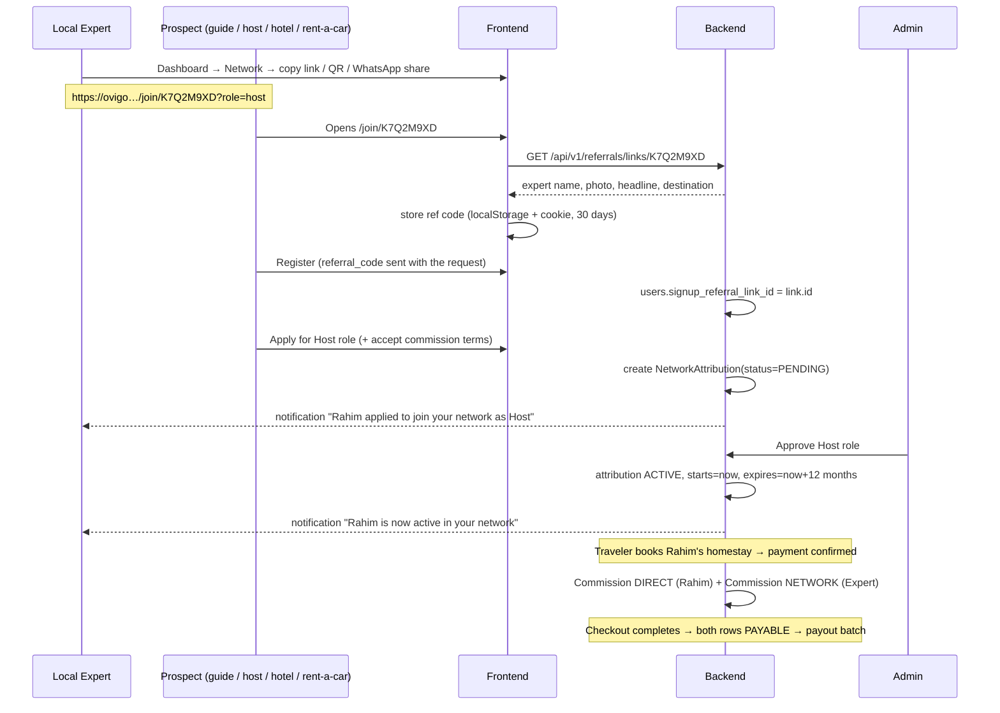

# Ovigo — Implementation Plan for PRD §10 & §12 (+ Expert Referral Link)

**Prepared:** 2026-10-04
**Inputs:** [PRD_AUDIT_SECTIONS_10_12.md](PRD_AUDIT_SECTIONS_10_12.md), `OVIGO PRODUCT REQUIREMENTS DOCUMENT.pdf` (§10, §12, §13, §21.4, §22, §25.4–25.6), and the code on `main` as of commit `06597bd`.
**Continues:** [PROGRESS_TRACKER.md](PROGRESS_TRACKER.md) Phase 8, so the phases here are numbered **Phase 9.x**.

---

## 0. TL;DR

1. **The audit is about half out of date.** It lists many §10 fields as missing that commit `942621d` already added. It also uses field names that don't exist in the schema (e.g. `Tour.cover_image_url`, `price_per_person`, `TourActivity.capacity`). Each audit row was re-checked against the code, and §1 lists the corrections so nobody rebuilds working features.
2. **The main new feature is Phase 9.1, the Expert Referral Link.** Every approved Local Expert gets a personal link (and QR code) on their dashboard. A Guide, Host, Hotel or Rent-a-Car operator who signs up through it is tied to that expert. Once Ovigo approves them, the expert earns a **network commission** on every booking that partner completes, for a set period (12 months by default). Guides who join this way are also placed under that expert's supervision automatically.
3. **Five bugs turned up during the check.** These are not in the audit. Two of them directly affect referral earnings: ride-bid bookings never create any commission, and the network cut isn't capped. They're fixed in Phase 9.2 (§3).
4. Suggested order: **9.1 → 9.2 → 9.4 → 9.5 → 9.6 → 9.3 → 9.7**. Guide payouts (9.3) needs a business decision first (§10).

| Phase | Scope | PRD | Size |
|---|---|---|---|
| **9.1** | Expert referral link, network attribution, network dashboard | §5.2, §12.4, §12.5, §25.4, §25.6 | L |
| **9.2** | Commission engine fixes and completion (ride-bid bug, cap, self-booking guard, acquisition channel, tour-curation) | §12.4, §12.5, §21.4, §22 | M |
| **9.3** | Guide fees paid through Ovigo + guide network/supervision commission | §12.4, §13.1–13.3, §22 | M (*decision needed*) |
| **9.4** | Business network: type enum, 5 ownership types, documents, terms, booking gate | §12.1–12.3 | M |
| **9.5** | Tour listing and checkout gaps (category, add-ons/tax/child/infant/deposit at checkout, badges, photos) | §10.2–10.3 | M |
| **9.6** | Tour approval: trusted-expert auto-approval, high-risk moderation | §10.5 | S |
| **9.7** | Expert public profile: reviews, chat, associated guides/stays/transport | §8.2 | S |

---

## 1. Audit check: what's already built

### 1.1 Rows the audit marks ❌ or ⚠️ that the code already covers

| Audit item | Audit says | Actually in the code |
|---|---|---|
| Remaining seats (10.2) | ⚠️ not stored | ✅ `TourDeparture.available_seats`, locked and decremented on booking and released on cancel (`bookings/service.py:59-83`) |
| Stay: property type / room type / nights | ❌ | ✅ `TourStay.property_type`, `room_category`, `nights` |
| Transport: AC / seating capacity | ❌ | ✅ `TourTransport.has_ac`, `capacity` |
| Itinerary arrival/departure time | ❌ | ✅ `TourItineraryDay.arrival_time`, `departure_time` |
| Snacks | ❌ | ✅ `MealType.SNACK` (drinks still have no field of their own) |
| Pickup map pin | ❌ | ✅ `Tour.pickup_coordinates` (JSONB) |
| Infant / tax / service charge / deposit / full-payment deadline | ❌ | ✅ **stored and displayed**: `Tour.infant_price`, `tax_rate`, `service_charge_rate`, `deposit_percentage`, `payment_deadline_days`. ⚠️ **None of them are applied at checkout** (see §6). |
| Add-on system | ❌ no model | ✅ `TourAddon` model, shown on `/tours/[id]`. ⚠️ **Travelers can't pick one at booking** (see §6). |
| High-risk activities | ❌ | ⚠️ `TourActivity.is_high_risk` exists and blocks unqualified guides (`guides/service.py:240`), but doesn't trigger stricter tour review (see §7) |
| Reapproval after material edits | ✅ | ✅ confirmed: `MATERIAL_REAPPROVAL_FIELDS` (`tours/service.py:117`) |
| Expert UI for the business network | ❌ none | ✅ `/dashboard/business-network` (add, list, invite link) and `/business-network/claim/[token]` |
| Referral commission engine | ⚠️ "not yet connected" | ✅ **connected**: `commissions/service.py::create_commissions_for_booking` adds a `NETWORK` commission row whenever a partner linked through an approved `BusinessReferral` earns a direct commission. The "Sprint 14-15 deferred" note in `business_network/models.py` is outdated. |
| Which commission rule applied | ❌ | ✅ `Commission.rule_id` |
| Commission rule start/expiry | ❌ | ✅ `CommissionRule.effective_date` / `expiry_date`. ❌ But there's still no **per-referral agreement** expiry. |
| Duplicate business claims | ❌ | ✅ in the service layer, by name/phone/email: `business_network/service.py::_check_duplicate` |
| Self-referral | ❌ | ⚠️ **flag only**: `fraud_service.check_self_referral` runs after `link_partner`. It raises a flag but doesn't block. |
| Referral volume abuse | — | ✅ `fraud_service.check_referral_network_volume` |
| Expert bio / years / languages | ❌ | ✅ `LocalExpertProfile.bio`, `years_experience`, `languages` |

### 1.2 Gaps confirmed as real

**§10:** tour `category` (separate from type); stay certification/trust badges; transport photos and safety documents; actual itinerary visit date (only `day_number` exists); add-on selection, tour tax/service charge, child/infant pricing and deposit at checkout; auto-approval for trusted experts; stricter moderation for high-risk tours.

**§12:** no expert **referral link** (the only way in today is a per-business claim link created after admin approval, and guides must already have an account before an expert can invite them by email); `business_type` is free text; only 2 of the 5 ownership types; no business documents or commission-terms acceptance; no per-referral commission start/expiry; no acquisition channel on bookings; no tour-curation commission; self-referral and circular arrangements are flagged but not blocked.

### 1.3 New bugs found during the check (not in the audit)

| # | Bug | Where | Impact |
|---|---|---|---|
| B1 | `RIDE_BID` booking items never create a commission. `_partner_role_for_item` has no branch for that type, and `_LEGACY_DEFAULTS` has no rate for it. | `commissions/service.py:43-68` | Ovigo takes 0% on ride bids, and a Rent-a-Car partner joining through a referral would never earn the expert anything on them |
| B2 | Network commission isn't capped. `custom_commission_rate` can be anything up to 1.0 (`SetCommissionRateRequest`), so the referral cut can exceed Ovigo's own direct commission on the same item. | `commissions/service.py:211-232` | Ovigo can lose money on a booking |
| B3 | Network commission is paid even when the referring expert books the referred partner themselves. | same | Lets an expert farm referral earnings off their own bookings |
| B4 | Tour checkout only accepts `status == PUBLISHED`, but `PUBLIC_TOUR_STATUSES` also lists `SCHEDULED`, `BOOKING_OPEN` and `ALMOST_FULL`. | `bookings/service.py:69` vs `tours/service.py:93` | A tour in one of those statuses appears in listings but can't be booked |
| B5 | Tour `tax_rate`, `service_charge_rate`, `child_price`, `infant_price` and `deposit_percentage` are display-only. The traveler is charged `base_price × quantity`. | `bookings/service.py::_reserve_tour_departure` | The listed price and the charged price disagree |

---

## 2. Phase 9.1: Expert Referral Link (headline feature)

### 2.1 User story

> As a **Local Expert**, my dashboard has my own referral link. When a **guide or a business** (homestay, hotel, rent-a-car operator) joins Ovigo through it, they are tied to me. Once Ovigo approves them, **I earn a commission on the bookings they complete**.

This covers PRD §5.2 ("Earn referral commission from approved businesses added through the Expert's network"), §12.4 (Referral and Network Commission), §25.4 ("Invite Host / Invite transport operators / View referrals / View network bookings / View referral commission") and §25.6 ("Referral earnings / Network earnings").

### 2.2 Business rules (recommended defaults, admin-configurable)

| Rule | Default | Why |
|---|---|---|
| Who gets a link | Every **approved** `LOCAL_EXPERT` role, created on first visit to the dashboard | Matches the PRD; suspended experts' links stop working |
| Roles that can join through a link | `GUIDE`, `HOST`, `HOTEL`, `RENT_A_CAR`, plus "local business" (restaurant, photographer, etc. — becomes a `BusinessReferral`) | These are what PRD §12.1 and §13.1 list |
| Can a Local Expert join through another expert's link? | **No** | Keeps the network one level deep. A multi-level chain (an expert earning on a referral's referrals) is a pyramid risk, and blocking it rules out most circular setups. |
| Commission levels | **Single level.** Only the direct referrer earns. | Same reason |
| Who gets credit | **First touch wins.** A partner role has at most one referrer for life. A second link can't override it. Only an admin can reassign it, and that is audit-logged. | PRD §12.5 "duplicate business claims" |
| When commission starts | When an admin **approves** the referred partner's role | PRD §12.3: "No business may receive bookings until … Ovigo approves" |
| How long it lasts | **12 months** from approval (configurable per attribution) | PRD §12.5 "Commission start and expiry date" and "Commission after an agreement expires" |
| Rate | 2% of the item subtotal by default (the existing `_DEFAULT_NETWORK_RATE`). Override order: per-attribution rate → NETWORK rule for the item type → global NETWORK rule. | Reuses the existing rules engine |
| Who pays it | **Out of Ovigo's own commission** on that booking item, never out of the partner's earnings. Capped at Ovigo's direct commission on that item. | The partner's net stays the same, so they don't lose anything by being referred (fixes B2) |
| When it becomes payable | Same as the direct commission: `PENDING` when paid → `PAYABLE` at completion → `PAID` in a payout. Frozen if the booking goes into dispute. | Reuses the existing lifecycle |
| Guide joining through a link | Also creates an **accepted** `GuideSupervision` under the referring expert. The guide role still needs admin approval. | The guide chose this expert by using the link, so a separate invite step isn't needed |

### 2.3 Flow



### 2.4 Data model (new migration)

**`expert_referral_links`**

| Column | Type | Notes |
|---|---|---|
| `id` | uuid PK | |
| `expert_role_id` | FK `partner_roles.id` CASCADE | Partial unique index `WHERE is_active` (one live link per expert) |
| `code` | varchar(16) unique | 8 characters of Crockford base32 (no 0/O/1/I), e.g. `K7Q2M9XD`. Hard to guess, easy to read out over the phone. |
| `is_active` | bool | `false` after "regenerate link". Old attributions are kept. |
| `visit_count` | int default 0 | Incremented by the public lookup, best effort |
| `created_at`, `deactivated_at` | timestamptz | |

**`network_attributions`** (the single source of truth for "who referred whom"; the commission engine reads only this table)

| Column | Type | Notes |
|---|---|---|
| `id` | uuid PK | |
| `referring_expert_role_id` | FK `partner_roles.id` CASCADE, indexed | |
| `referred_user_id` | FK `users.id` CASCADE | |
| `referred_partner_role_id` | FK `partner_roles.id` CASCADE, **unique** | Enforces first-touch-wins in the database |
| `role_type` | `partner_role_type` enum | Denormalized for dashboard filters |
| `source` | new enum `network_attribution_source`: `REFERRAL_LINK`, `BUSINESS_REFERRAL`, `GUIDE_INVITE`, `ADMIN` | How the attribution was created. Reportable under PRD §12.5. |
| `referral_link_id` | FK, nullable | Set when `source = REFERRAL_LINK` |
| `business_referral_id` | FK `business_referrals.id`, nullable | Set when `source = BUSINESS_REFERRAL` |
| `status` | new enum `network_attribution_status`: `PENDING`, `ACTIVE`, `REJECTED`, `REVOKED`, `EXPIRED` | |
| `custom_commission_rate` | numeric(5,4), nullable | Per-attribution override, capped per §2.6 |
| `commission_starts_at` / `commission_expires_at` | timestamptz, nullable | Set on approval |
| `terms_accepted_at` / `terms_version` | timestamptz / varchar(20) | The referred partner accepting the commission terms (PRD §12.3) |
| `revoked_reason` | text, nullable | |
| `created_at`, `updated_at` | timestamptz | |

**Column changes to existing tables**

- `users.signup_referral_link_id`: FK, nullable. Keeps first-touch credit when someone registers through a link today and applies for a partner role next week.
- `commissions.attribution_id`: FK `network_attributions.id`, nullable. Set on every `NETWORK` row, so any referral payout can be traced back to the attribution that produced it (PRD §12.5 "which booking generated revenue / which commission rule applied").

**Repo convention reminder:** this codebase stores SQLAlchemy enums by **member NAME** (uppercase). Adding a value to an existing native enum must happen inside `op.get_context().autocommit_block()`. See `migrations/versions/56c0f6183bbe_*.py` and the `942621d` commit message.

### 2.5 API

New module `app/modules/referrals/` (`models.py`, `schemas.py`, `service.py`, `router.py`), registered in `app/main.py` with a `referrals` entry in `OPENAPI_TAGS`. The admin routes go under `/api/v1/admin/...` so `/partner-docs` excludes them automatically.

| Method & path | Auth | Purpose |
|---|---|---|
| `GET /api/v1/referrals/me` | approved Local Expert | Returns (and creates on first call) the expert's active link: `code`, `url`, a URL per role (`?role=guide` etc.), and stats (`visits`, `signups`, `pending`, `active`, `expired`, `network_earnings_total`) |
| `POST /api/v1/referrals/me/regenerate` | approved Local Expert | Deactivates the old code and issues a new one. Existing attributions are unaffected. |
| `GET /api/v1/referrals/me/members` | approved Local Expert | Paginated attributions, each with member name, role, status, start/expiry, completed booking count and network earnings (pending/payable/paid). Filter by `status` and `role_type`. |
| `GET /api/v1/referrals/links/{code}` | public, rate-limited (`app/core/rate_limit.py`) | Display info for the landing page: expert display name, photo, headline, primary destination, verified badge, allowed role types. **No contact details.** Returns 404 for inactive codes and suspended experts. |
| `POST /api/v1/auth/register` *(changed)* | public | New optional `referral_code`. If it's valid, set `users.signup_referral_link_id`. If it's invalid, **ignore it silently** so a typo doesn't block signup. |
| `POST /api/v1/partners/roles` *(changed)* | user | New optional `referral_code` and `accept_commission_terms: bool`. Creates the `PENDING` attribution (rules in §2.6). |
| `GET /api/v1/admin/network-attributions` | admin `referrals.manage` | List with filters for expert, status, role and source |
| `POST /api/v1/admin/network-attributions/{id}/revoke` | admin `referrals.manage` | Requires a reason. Future bookings stop earning. Unpaid `NETWORK` rows are set to `CANCELLED`. |
| `POST /api/v1/admin/network-attributions/{id}/reassign` | admin `referrals.manage` | Moves the attribution to a different expert, with a reason. Audit-logged. |
| `POST /api/v1/admin/network-attributions/{id}/terms` | admin `referrals.commission` | Sets `custom_commission_rate` and `commission_expires_at` (extend or shorten) |

### 2.6 Backend logic

**Creating the attribution in `partners/service.py::apply_for_role`**

1. Resolve the code: the `referral_code` in the request, falling back to `user.signup_referral_link_id`. If neither is present, there's no attribution and the flow is unchanged.
2. Reject these with a 409 and a clear message:
   - `role_type == LOCAL_EXPERT` ("experts can't be referred")
   - the link is inactive, or the referring expert's role isn't `APPROVED`
   - **self-referral**: the referring expert's `partner_account.user_id == user.id`
   - **reciprocal**: the referred user holds a Local Expert role that already has an attribution pointing at any role of the referring user. This blocks "A refers B's homestay, B refers A's homestay".
3. If an attribution already exists for this `partner_role_id`, leave it alone (first touch wins). That covers a role that was rejected and is being re-applied for: its attribution goes back to `PENDING` with the same referrer.
4. Require `accept_commission_terms == true` whenever a code is present, and store `terms_accepted_at` and `terms_version`.
5. Create a `NetworkAttribution(status=PENDING, source=REFERRAL_LINK)`.
6. **If the role is GUIDE** and the guide has no `PENDING`/`ACCEPTED` supervision, create `GuideSupervision(local_expert_role_id=referrer, status=ACCEPTED, responded_at=now)`. If one already exists, record the attribution but leave supervision alone (`uq_guide_single_supervisor`).
7. Notify the expert. This needs a new `NotificationType.NETWORK_MEMBER_JOINED`, added with `autocommit_block`.

**Activation in `admin/service.py::approve_role` / `reject_role`**

- On approve, every `PENDING` attribution for that role becomes `ACTIVE`, with `commission_starts_at = role.approved_at` and `commission_expires_at = starts + NETWORK_ATTRIBUTION_MONTHS` (a config setting, default 12). The expert is notified.
- On reject, the attribution becomes `REJECTED`.
- When a role is suspended (`PartnerRoleStatus.SUSPENDED`), the attribution stays `ACTIVE`, but the commission engine skips suspended partners anyway, because they can't take bookings.

**The commission engine in `commissions/service.py`**

Replace `_approved_referral_for_partner()` with `_active_attribution_for(db, partner_role_id, booking)`. It returns an attribution only when **all** of these hold:

- `status == ACTIVE`
- `commission_starts_at <= booking.created_at < commission_expires_at` (PRD: no commission after the agreement expires)
- the referring expert's role is `APPROVED` (a suspended expert earns nothing new)
- `booking.user_id` isn't the referring expert's user (fixes **B3**)

Network rate resolution: `attribution.custom_commission_rate` → a `NETWORK`-scope `CommissionRule` matching `item_type` → a global `NETWORK` rule → `_DEFAULT_NETWORK_RATE`. `_resolve_network_rate` gains an `item_type` parameter, and `CommissionRule.item_type` already exists for this.

**Cap (fixes B2):** `network_amount = min(subtotal × network_rate, direct_commission_amount)`. Also add a validator so an admin can't save a `custom_commission_rate` above the partner's direct rate. The UI shows the cap.

Write `Commission(source=NETWORK, attribution_id=…, rule_id=…)`. `preview_commission` uses the same helper so the admin preview stays accurate.

**Worked example.** A homestay referred by Expert Karim earns BDT 10,000. The ROOM_TYPE category rate is 12% and the network rate is 2%.

| Row | gross | rate | commission_amount | partner_net_amount | Goes to |
|---|---|---|---|---|---|
| DIRECT | 10,000 | 0.12 | 1,200 | 8,800 | Host gets 8,800; Ovigo keeps 1,200 |
| NETWORK | 10,000 | 0.02 | 200 | 200 | Karim gets 200, **paid out of Ovigo's 1,200**, so Ovigo nets 1,000 |

**Backfill (same migration).** For every `BusinessReferral` with `status = APPROVED` and a `linked_partner_role_id`, insert a `NetworkAttribution(source=BUSINESS_REFERRAL, status=ACTIVE, commission_starts_at=referral.created_at, commission_expires_at=migration_date + 12 months)`. Existing referrers keep earning exactly as they do today. `business_network/service.py::link_partner` now also writes or updates the attribution, so both entry points feed the same table.

**Expiry (no cron).** Follow the codebase's existing approach of working out expiry when a record is read rather than flipping a stored status on a schedule (`partners/models.py:90`, `badges/models.py:66`). The engine's window check already handles money. The dashboard and admin APIs report an `ACTIVE` row whose `commission_expires_at` has passed as `expired`, and show an "expiring in 30 days" count. If a stored `EXPIRED` status is ever wanted for reporting, add an admin-triggered scan endpoint like `fraud/router.py::scan_expired_vehicle_documents`, and send the expert's 30-day warning from that scan.

**Fraud hooks.** Run `fraud_service.check_referral_network_volume` when an attribution is activated, not only on business-referral approval. Keep `check_self_referral` as the backstop that flags second accounts the user-ID check in step 2 can't see.

### 2.7 Frontend

| Page | Change |
|---|---|
| **`/dashboard/network`** (new; added to `Header.tsx` and `MobileMenu.tsx` for `local_expert`, next to Business Network) | **"Your referral link" card**: the link with a copy button, a QR code (`qrcode.react` is already a dependency), a WhatsApp share button, "Download QR" as PNG, and "Regenerate" behind a confirmation. **Role-specific links**: Guide, Homestay/Host, Hotel, Rent-a-Car, Local business. **Stats row**: visits, signups, pending approval, active, expiring in 30 days, network earnings. **Members table**: name, role, joined date, status badge, expiry date, completed bookings, earnings. Filters by status and role. |
| **`/join/[code]`** (new, public) | "You've been invited by **{expert}** to join Ovigo." Shows the expert card and a role picker (or the role preselected from `?role=`). Saves the code to `localStorage` and a cookie (30 days; wrap the reads in try/catch). Then **Register** if logged out, or **Continue to application** if logged in. An invalid or inactive code shows a friendly message and a plain sign-up button. |
| `/account/register` | Reads `ref` from the query string or `localStorage` and sends `referral_code`. Shows an "Invited by …" banner. |
| `/account/partner` | Preselects the role from `?role=`. When a code is stored, shows the "Joining {expert}'s network" banner and a required **commission-terms** checkbox linking to the terms page, then sends `referral_code` and `accept_commission_terms`. Hides `local_expert` from the picker when a code is present. |
| `/dashboard/earnings` | Splits the expert card into **Direct earnings** and **Network earnings**, using `CommissionRead.source`, which the API already returns. |
| `/dashboard/guides` | Guides who joined through the link show up automatically, since they're ordinary supervisions, with a "Joined via your link" tag. |
| `/admin/business-network` | New **Network attributions** tab: filters, revoke, reassign, and edit rate/expiry, with a reason dialog for each. |
| `src/types/referrals.ts` | Types for the new endpoints |

Follow `frontend/DESIGN_SYSTEM.md` and the existing `Card`/`Badge`/`EmptyState` components. `frontend/AGENTS.md` warns that this Next.js version differs from what models were trained on, so check `node_modules/next/dist/docs/` before adding the new dynamic route.

### 2.8 Tests

CI currently runs `pytest` **with no database** (`.github/workflows/ci.yml`), so the existing tests are schema-level only. This feature moves money, so:

1. **Unit tests (no DB)** for the pure rules, pulled out into small functions: the eligibility check (self, reciprocal, Local Expert role, inactive link), the rate-resolution order, the cap, the expiry window, and the code alphabet and length.
2. **Recommended:** add a `postgres:16` service container to the backend CI job, plus an `alembic upgrade head` step. That allows integration tests of the full chain: register with code → apply → admin approve → book → pay → complete → `DIRECT` + `NETWORK` rows → payout. Include the negative cases: an expired window, an expert booking their own referral, a revoked attribution, a disputed booking (`ON_HOLD`), a suspended expert, and first touch winning over a second code.

### 2.9 Acceptance criteria

- [ ] An approved Local Expert sees their personal link and QR code at `/dashboard/network`. A pending, rejected or suspended expert doesn't.
- [ ] A new user who opens `/join/{code}?role=host`, registers and applies for Host appears in the expert's members list as **Pending**, and the expert is notified.
- [ ] After admin approval, the member shows **Active** with an expiry date 12 months later.
- [ ] A paid booking for that host creates a `DIRECT` row for the host and a `NETWORK` row for the expert (with `attribution_id` set), and the host's net is unchanged.
- [ ] Network earnings appear separately on `/dashboard/earnings` and move from pending to payable to paid along with the booking.
- [ ] A guide who joins through the link appears under **My Guides** as accepted, awaiting admin approval of the guide role.
- [ ] Self-referral, referral of a Local Expert role, and reciprocal referral are blocked with a clear error. A second expert's link doesn't change the existing referrer.
- [ ] No `NETWORK` row is created after expiry, after revocation, for the expert's own bookings, or above Ovigo's direct commission.
- [ ] Existing approved and linked business referrals keep earning after the migration (backfill verified).

---

## 3. Phase 9.2: Commission engine completion (§12.4, §12.5, §21.4, §22)

| # | Item | Change |
|---|---|---|
| 1 | **B1 ride-bid commission** | Add a `RIDE_BID` branch to `_partner_role_for_item` (`RideBid.rent_a_car_role_id`) and a `_LEGACY_DEFAULTS[RIDE_BID]` entry. Seed a `CATEGORY` rule in a migration, the same way `7d47c6cabae8_seed_vehicle_rental_commission_rule.py` did. |
| 2 | **B2 / B3** | Covered in 9.1 §2.6 (cap and self-booking guard). Ship them together. |
| 3 | **Acquisition channel** (§12.5 "organically, through an Expert or through advertising") | New `bookings.acquisition_channel` enum `ORGANIC` / `EXPERT_NETWORK` / `ADVERTISING` / `EXPERT_DIRECT`, plus nullable `bookings.ad_campaign_id`. It's set at booking creation: `ADVERTISING` when the cart carries an ad click, `EXPERT_NETWORK` when any item resolves to an active attribution, `ORGANIC` otherwise. The ads module only keeps **aggregate** click counters, with no link from a click to a booking (`ads/models.py` docstring). So this item also needs the ad click-through URL to carry `?ad=<campaign_id>`, stored client-side for the session and sent with the booking. Add a breakdown to `admin/reports.py`. |
| 4 | **Seller attribution** (§12.5 "who sold the service") | Nullable `booking_items.sold_by_role_id`. It's set to the tour's expert for tour items and to the bidding expert for custom-bid items. It's used by item 5. |
| 5 | **Tour-curation commission** (§12.4) | Applies when an expert's tour includes a `TourStay` with `property_id` (an Ovigo property) or a transport line linked to an Ovigo vehicle, and the traveler books that stay or vehicle **through the tour's booking flow**. The expert then earns a `CURATION` cut of that item (new `CommissionSource.CURATION`, new `CommissionRuleScope.CURATION` rate). It follows the same cap and funding rule as NETWORK. If the same expert also holds a network attribution for that partner, pay **only the higher one**, never both. |
| 6 | **Network rates per item type** | `_resolve_network_rate(item_type)` and the admin commission-rules UI: allow a `NETWORK` rule with an `item_type` set |
| 7 | **Update the outdated docstrings** | `business_network/models.py` and `commissions/models.py`, so they describe the attribution table |

---

## 4. Phase 9.3: Guide fees through Ovigo + guide commission (§12.4, §13, §22) — *decision needed*

**Today:** a guide's "earnings" are an informational `GuideAssignment.fee_amount` that the expert pays privately (`guides/models.py` docstring). No Ovigo money moves, so **there is nothing yet to take a network commission from** when a guide joins through a link. Phase 9.1 still records who referred the guide and sets up supervision, so the attribution is ready once guide money flows through Ovigo.

**Recommended model (needs product sign-off):**

1. When an assignment with a `fee_amount` is **completed** (and verified, per PRD §13.3), create a `Commission(source=GUIDE_FEE, partner_role_id=guide)` for the fee, **deducted from the assigning expert's net** on that departure's `DIRECT` rows. Ovigo then pays the guide directly through the existing payout batches, which matches PRD §13.3 ("Earnings become eligible for payout").
2. **Guide network commission:** if the guide was referred by expert **A** and is assigned by a *different* expert **B** (allowed by PRD §13.4), A earns a `NETWORK` cut of the guide fee. It's funded by an Ovigo platform fee on guide fees (new `CATEGORY` rule for a `GUIDE_SERVICE` item type), with the same cap as everything else.
3. **No commission when the referrer is also the assigner.** If A refers and also assigns the guide, A would be taking a cut of a fee A is paying. That is a circular arrangement the PRD says to prevent, so nothing is created. PRD §13.1's "internal earning or revenue-share terms" between expert and guide are already expressed by the fee A sets.
4. This also requires PRD §13.4, *multiple experts per guide*: drop `uq_guide_single_supervisor` in favor of unique `(guide_role_id, local_expert_role_id)`.

**Alternative (smaller):** keep guide fees off-platform, and only pay network commission when a referred guide later applies for, and is approved as, a Host, Hotel or Rent-a-Car partner. Under the 9.1 rule, a new role applied for while the user's attribution is active gets attributed to the same referrer automatically. This needs no money-flow change but delivers less of what was asked.

---

## 5. Phase 9.4: Business network completion (§12.1–12.3)

| # | Item | Change |
|---|---|---|
| 1 | **Business type enum** (§12.1) | `BusinessType` enum with the 12 PRD values (`HOTEL`, `RESORT`, `HOMESTAY`, `GUESTHOUSE`, `RESTAURANT`, `LOCAL_TRANSPORT`, `RENT_A_CAR`, `ACTIVITY_PROVIDER`, `PHOTOGRAPHER`, `LOCAL_PRODUCT_BRAND`, `EQUIPMENT_RENTAL`, `EVENT_CULTURAL`) plus `OTHER`. The migration maps existing free text onto the enum; anything that doesn't match becomes `OTHER`, with the original text kept in a new `business_type_note`. The form uses a select. |
| 2 | **Ownership types** (§12.2) | Add `MANAGED`, `PARTNER` and `UNVERIFIED_RECOMMENDATION` (inside `autocommit_block`, member NAMEs). `OWNED` and `MANAGED` get no owner invite. `UNVERIFIED_RECOMMENDATION` **can never be linked to a partner or earn commission** until it's converted to `REFERRED` and goes through the invite and verification steps. |
| 3 | **Documents** (§12.3) | Reuse `PartnerDocument` instead of building a new upload table. A referred business that becomes a partner uploads documents through the existing partner-role flow. The admin "link partner" step checks that the linked role is `APPROVED` and has its required documents verified (the Phase 8.3 verification lifecycle). For businesses that never become partners (restaurants etc.), add an optional `business_referral_documents` table only if the product needs it. |
| 4 | **Commission terms acceptance** (§12.3) | `PartnerRole.commission_terms_accepted_at` and `commission_terms_version`, captured on the partner application form for **every** partner, referred or not. Listings (tours, properties, vehicles) can't be submitted for review until it's set. |
| 5 | **"No bookings until…" gate** (§12.3) | A partner reached through a referral can't be booked until: the owner has claimed (`invite_accepted_at`), documents are verified, the role is `APPROVED`, and terms are accepted. Check this centrally in the listing-submission guard. |
| 6 | **Referral link ↔ business referral** | The `/join/{code}?role=business` path creates a `BusinessReferral(ownership_type=REFERRED, invited_user_id=current_user, source=referral_link)` pre-claimed by the joiner, so the owner-invite step is already done. |
| 7 | **Network bookings view** (§25.4 "View network bookings") | `GET /api/v1/referrals/me/bookings` lists completed bookings that produced network commission, with traveler details masked. It's shown on `/dashboard/network`. |

---

## 6. Phase 9.5: Tour listing and checkout gaps (§10.2–10.3)

| # | Item | Change |
|---|---|---|
| 1 | **B4 bookable statuses** | `bookings/service.py::_reserve_tour_departure`: accept `PUBLISHED`, `SCHEDULED`, `BOOKING_OPEN` and `ALMOST_FULL` (a `BOOKABLE_TOUR_STATUSES` constant in `tours/service.py`). Then move tours to `ALMOST_FULL` / `SOLD_OUT` automatically when `available_seats` crosses a threshold (default 20% remaining) and drops to 0. |
| 2 | **B5 checkout pricing** | `BookingItemCreate` gains `adults`, `children`, `infants` and `addon_ids`. `_reserve_tour_departure` prices adults × (`price_override` or `base_price`) + children × `child_price` + infants × `infant_price` + the selected `TourAddon.price`. Tax and service charge go into `Booking.tax_service_amount`, kept **out of** `BookingItem.subtotal` the same way `_room_tax_and_service_charge` does, so commission stays on the service price. Store the chosen add-ons in a new `booking_item_addons` table (price snapshot). Seats consumed = adults + children (infants don't take seats unless the tour says otherwise). |
| 3 | **Deposit and full-payment deadline** | If `deposit_percentage` is set, the payment flow charges the deposit first and creates a balance due at `departure_date − payment_deadline_days`, with a reminder notification and auto-cancel after the deadline. This is the largest item in 9.5. Ship it last, behind a flag. |
| 4 | **Tour category** | Add `Tour.category`, an admin-managed list (Beach, Hill, Cultural, Wildlife, Religious, City, …). The legacy `TourType` values `BEACH`, `WILDLIFE`, `RELIGIOUS`, `CITY`, `TREKKING`, `CRUISE` and `ROMANTIC` are really categories, so migrate them across and remove them from the type picker. Add it as a search filter. |
| 5 | **Stay trust badges** | When `TourStay.property_id` is set, show that property's existing badges (badges module). For external stays, add a `certifications` JSONB list. |
| 6 | **Transport photos and safety documents** | `TourTransport.photos` (JSONB of storage keys, using the same R2 path as `TourImage`) and `safety_document_keys`. Pull from `Vehicle` when the transport is linked to an Ovigo vehicle. |
| 7 | **Itinerary visit date** | Compute it for each departure as `departure_date + day_number − 1` in the API response. No column needed. |
| 8 | **Drinks** | Add a `drinks_included` text field on `TourMeal`. |

---

## 7. Phase 9.6: Tour approval (§10.5)

| # | Item | Change |
|---|---|---|
| 1 | **Trusted-expert auto-approval** | `LocalExpertProfile.is_trusted`, set by an admin (default rule: at least 5 completed tours, rating ≥ 4.5, no open fraud flags or disputes). `submit_for_review` publishes immediately when the expert is trusted **and** the tour has no high-risk activity. The admin still sees it in a "recently auto-approved" list and can suspend it. |
| 2 | **High-risk moderation** | Any tour with `TourActivity.is_high_risk` always goes to manual review, even from trusted experts. The admin queue shows a red "High-risk" badge, and approval requires confirming a safety checklist (insurance, permits, a guide at `LEVEL_2` certification). This reuses the Phase 8.2 certification gate. |

---

## 8. Phase 9.7: Expert public profile (§8.2; the audit's cross-cutting items)

Real gaps on `/experts/[id]`: a **reviews list** (the reviews module exists; add a `GET /reviews?expert_role_id=` query); a **chat button** (the chat module exists; start a conversation from the profile); **associated Guides** (accepted supervisions); **associated stays and transport** (`TourStay.property_id`, plus network members once 9.1 ships); per-category rating breakdown; average response time; and a certifications display. Bio, years of experience and languages **already exist**.

---

## 9. Order and dependencies

```
9.1 Referral link ──┬──► 9.2 Engine completion (B1-B3, channel, curation)
                    ├──► 9.4 Business network completion (§12.1-12.3)
                    └──► 9.3 Guide fees + guide commission (after decision)
9.5 Tour checkout (B4, B5) ── independent, can run in parallel with 9.2
9.6 Approval ── after 9.5 #4 (category) is optional; otherwise independent
9.7 Profile ── after 9.1 (shows network members)
```

Each phase follows the existing working rhythm in `IMPLEMENTATION_PLAN.md` §4: models → Alembic migration → schemas → service → router → tests → frontend → update `PROGRESS_TRACKER.md` (add **Phase 9 — PRD §10/§12 completion**) → commit and deploy.

---

## 10. Decisions needed from the product owner

1. **Default network rate and window.** The plan assumes 2% of the item subtotal for 12 months, paid out of Ovigo's commission. Confirm, or give different numbers per role (e.g. Hotel 2%, Rent-a-Car 1.5%, Guide 3%).
2. **Guide commission model (§4).** The recommended version moves guide fees through Ovigo, with network commission only when another expert assigns the guide. The smaller alternative only pays when a guide later becomes a Host or Rent-a-Car partner.
3. **Should Local Experts be able to refer other Local Experts?** The plan says **no** (one level only, to avoid pyramid structures). If yes, it would be a flat one-time bonus, never a recurring cut.
4. **Commission terms text and version.** Someone needs to write the terms page the checkbox links to (legal/business content).
5. **Deposit payments (9.5 #3).** Is split payment needed for launch, or can tours stay full payment for now?
